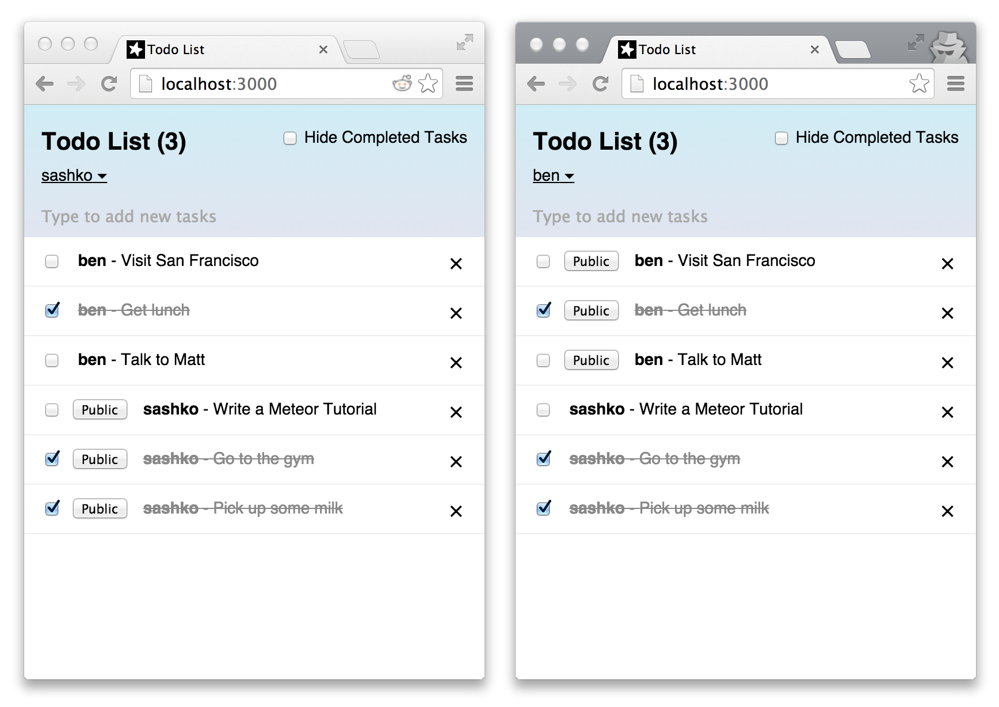

# Simple Todo List

The Meteor Tutorial app.

Learn how to build this app by following the [Meteor Tutorial](https://www.meteor.com/tutorials/react/creating-an-app).

Read more about building apps with Meteor in the [Meteor Guide](http://guide.meteor.com).

## Getting Started

### Install [Meteor](https://www.meteor.com/)

`curl https://install.meteor.com/ | sh`

### Clone repository

`$ git clone https://github.com/alextondello/todos-react`

### Run application

`$ cd todos-react`
`$ meteor npm install`
`$ meteor `

## Screenshots

